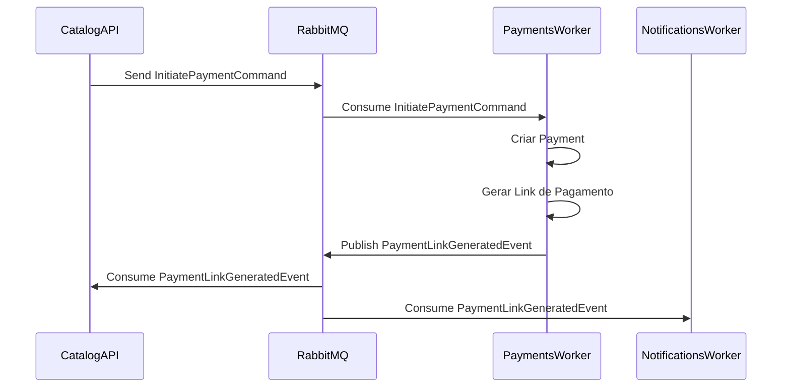
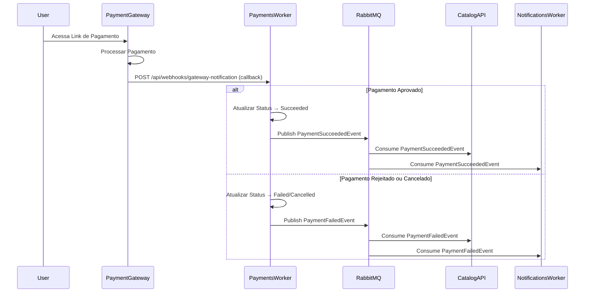
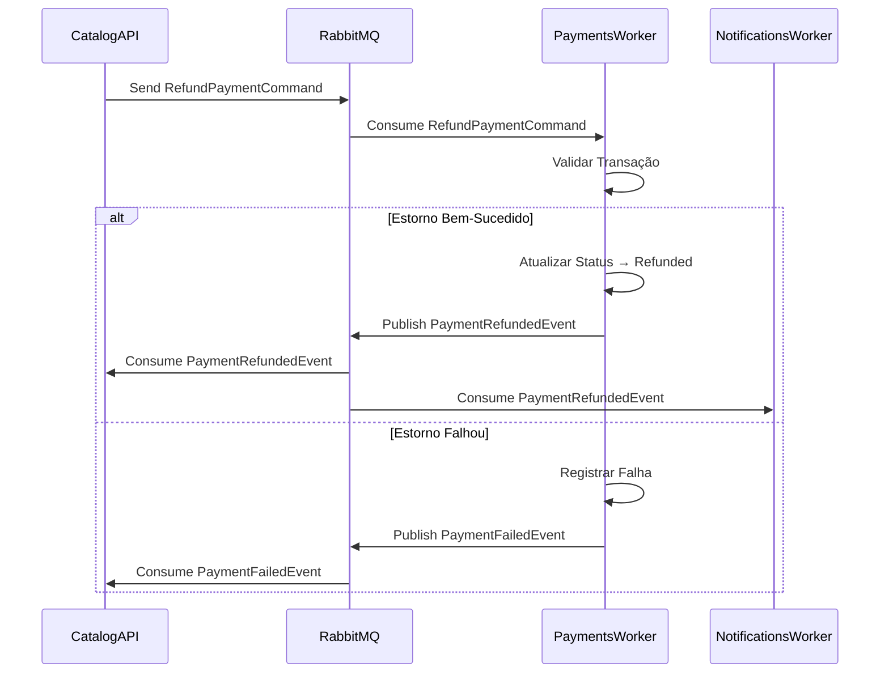
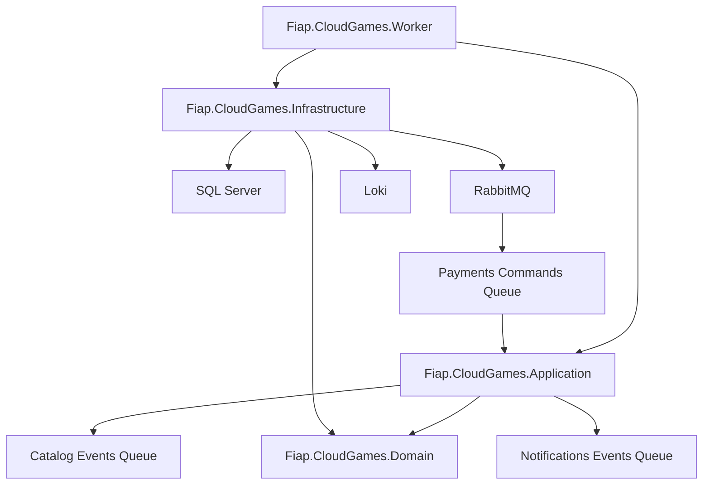

# Tech Challenge - FIAP Cloud Games - 10NETT - Grupo 30 - Fase 2


[](https://github.com/FIAP-10NETT-Grupo-30/cloud-games-fase-2-payments/tags)

## Microsserviço de Pagamentos (PaymentsWorker)

Este repositório contém o **Microsserviço de Pagamentos** da aplicação FIAP Cloud Games, responsável por processar pagamentos, gerar links de pagamento, processar estornos e notificar outros serviços sobre o status das transações na arquitetura de microsserviços orientada a eventos.

---

## Sumário 📝

- Documentos
  - [Instruções TC Fase 2 (Repositório de Orquestração)](https://github.com/FIAP-10NETT-Grupo-30/cloud-games-fase-2-orchestration/blob/main/docs/TC-NETT-FASE-2.md)
  - [Processo de Colaboração (Repositório de Orquestração)](https://github.com/FIAP-10NETT-Grupo-30/cloud-games-fase-2-orchestration/blob/main/docs/PROCESSO-COLABORACAO.md)
  - [Fluxos (Repositório de Orquestração)](https://github.com/FIAP-10NETT-Grupo-30/cloud-games-fase-2-orchestration/blob/main/docs/Fluxos/README.md)
  - [Kubernetes](./k8s/README.md)
- [Sobre este Microsserviço](#sobre-este-microsservico)
  - [Responsabilidades](#responsabilidades)
  - [Fluxos de Integração](#fluxos-de-integracao)
- [Como rodar o projeto](#como-rodar-o-projeto)
  - [Pré-requisitos](#pre-requisitos)
  - [Executando localmente com Docker Compose](#executando-localmente-com-docker-compose)
  - [Executando localmente com .NET](#executando-localmente-com-net)
  - [Deploy no Kubernetes](#deploy-no-kubernetes)
- [Estrutura de Pastas](#estrutura-de-pastas)
- [Arquitetura do Projeto](#arquitetura-do-projeto)
- [Variáveis de Ambiente](#variaveis-de-ambiente)

---

<a id="sobre-este-microsservico"></a>
## Sobre este Microsserviço 🎯

<a id="responsabilidades"></a>
### Responsabilidades

O **Microsserviço de Pagamentos** é responsável por:

- ✅ **Geração de Links de Pagamento**: Cria links únicos para pagamento após receber pedidos via comando
- ✅ **Processamento de Callbacks**: Recebe callbacks do gateway de pagamento simulado via webhook
- ✅ **Gestão de Transações**: Armazena e gerencia o histórico de todas as transações de pagamento
- ✅ **Processamento de Estornos**: Processa solicitações de reembolso de pedidos via comando
- ✅ **Integração com Catalog**: Consome comandos e publica eventos para o serviço de Catálogo
- ✅ **Integração com Notifications**: Publica eventos para o serviço de Notificações
- ✅ **Simulação de Gateway**: Fornece endpoint REST para simular callbacks de aprovação/rejeição de pagamentos
- ✅ **API REST com Swagger**: Expõe documentação interativa da API para o endpoint de webhook

<a id="fluxos-de-integracao"></a>
### Fluxos de Integração

#### 1️⃣ Fluxo de Iniciação de Pagamento



**Comando Consumido:**
- **Queue**: `payments.commands`
- **Command**: `InitiatePaymentCommand`
- **Dados**: `OrderId`, `Amount`, `UserId`, `UserEmail`
- **Ação**:  Cria transação de pagamento e gera link único

**Evento Publicado:**
- **Queue**: `catalog.events` e `notifications.events`
- **Event**: `PaymentLinkGeneratedEvent`
- **Dados**: `OrderId`, `UserEmail`, `PaymentTransactionId`, `PaymentLinkUrl`

#### 2️⃣ Fluxo de Processamento de Pagamento



**Endpoint de Webhook:**
- **URL**: `POST /api/webhooks/gateway-notification`
- **Autenticação**: Header `X-WEBHOOK-API-KEY` (configurado via `PaymentSettings:WebhookApiKey`)
- **Payload**: `PaymentGatewayCallbackDto` com `PaymentTransactionId` e `Status` (success, cancelled, failed)
- **Ação**: Atualiza status do pagamento e publica evento correspondente

**Eventos Publicados:**

**Sucesso:**
- **Queue**: `catalog.events` e `notifications.events`
- **Event**: `PaymentSucceededEvent`
- **Dados**: `OrderId`, `UserEmail`, `PaymentTransactionId`, `ProcessedAt`

**Falha:**
- **Queue**: `catalog.events` e `notifications.events`
- **Event**: `PaymentFailedEvent`
- **Dados**: `OrderId`, `UserEmail`, `FailedReason`

#### 3️⃣ Fluxo de Estorno de Pagamento



**Comando Consumido:**
- **Queue**: `payments.commands`
- **Command**: `RefundPaymentCommand`
- **Dados**: `OrderId`, `UserId`, `Reason`
- **Ação**: Processa estorno e atualiza status da transação

**Eventos Publicados:**

**Sucesso:**
- **Queue**: `catalog.events` e `notifications.events`
- **Event**: `PaymentRefundedEvent`
- **Dados**: `OrderId`, `UserEmail`, `RefundedAt`

**Falha:**
- **Queue**: `catalog.events` e `notifications.events`
- **Event**: `PaymentFailedEvent`
- **Dados**: `OrderId`, `UserEmail`, `FailedReason`

---

### Resumo dos Comandos Consumidos

| Comando | Ação no Payments | Consumer |
|---------|------------------|----------|
| `InitiatePaymentCommand` | Cria transação e gera link de pagamento | `InitiatePaymentConsumer` |
| `RefundPaymentCommand` | Processa estorno da transação | `RefundPaymentConsumer` |

### Resumo dos Eventos Publicados

| Evento | Destino | Dados |
|--------|---------|-------|
| `PaymentLinkGeneratedEvent` | Catalog, Notifications | OrderId, UserEmail, PaymentTransactionId, PaymentLinkUrl |
| `PaymentSucceededEvent` | Catalog, Notifications | OrderId, UserEmail, PaymentTransactionId, ProcessedAt |
| `PaymentFailedEvent` | Catalog, Notifications | OrderId, UserEmail, FailedReason |
| `PaymentRefundedEvent` | Catalog, Notifications | OrderId, UserEmail, RefundedAt |

---

<a id="como-rodar-o-projeto"></a>
## Como rodar o projeto ▶️

<a id="pre-requisitos"></a>
### Pré-requisitos ⚙️

- [Git](https://git-scm.com/downloads) instalado na sua máquina
- [Docker Desktop](https://www.docker.com/get-started) instalado e em execução
- [.NET 8 SDK](https://dotnet.microsoft.com/en-us/download/dotnet/8.0) ou superior (para execução local sem Docker)
- [DBeaver](https://dbeaver.io/download/) ou outro cliente de banco de dados compatível com SQL Server

<a id="executando-localmente-com-docker-compose"></a>
### Executando localmente com Docker Compose ⚡

**A forma recomendada de executar a aplicação completa é através do [Repositório de Orquestração](https://github.com/FIAP-10NETT-Grupo-30/cloud-games-fase-2-orchestration)**, que contém todos os docker-compose files e scripts necessários. 

Consulte o [guia de execução com Docker Compose](https://github.com/FIAP-10NETT-Grupo-30/cloud-games-fase-2-orchestration/blob/main/docs/Compose/README.md) no repositório de orquestração. 

<a id="executando-localmente-com-net"></a>
### Executando localmente com .NET 🔧

Para desenvolvimento local sem Docker: 

1. Clone o repositório: 
   ```bash
   git clone https://github.com/FIAP-10NETT-Grupo-30/cloud-games-fase-2-payments.git
   cd cloud-games-fase-2-payments
   ```

2. Restaurar as ferramentas do .NET:
   ```bash
   dotnet tool restore
   ```

3. Configurar o User Secrets: 
   ```bash
   cd src/Fiap.CloudGames.Worker
   dotnet user-secrets init
   
   # Configurar as secrets necessárias
   dotnet user-secrets set "ConnectionStrings:DefaultConnection" "Server=localhost,1433;Database=CloudGamesPayments;User Id=sa;Password=SuaSenha;TrustServerCertificate=True;"
   dotnet user-secrets set "RabbitMq:HostName" "localhost"
   dotnet user-secrets set "RabbitMq:UserName" "guest"
   dotnet user-secrets set "RabbitMq:Password" "guest"
   dotnet user-secrets set "PaymentSettings:WebhookApiKey" "your-local-api-key-for-testing"
   ```

4. Garantir que a infraestrutura esteja rodando:
   ```bash
   cd ../../cloud-games-fase-2-orchestration
   docker-compose -f docker-compose.infra.yaml up -d
   ```

5. Aplicar as migrações do banco de dados:
   ```bash
   cd ../cloud-games-fase-2-payments
   dotnet ef database update --project src/Fiap.CloudGames.Infrastructure --startup-project src/Fiap.CloudGames.Worker --context AppDbContext
   ```

6. Executar a aplicação:
   ```bash
   dotnet run --project src/Fiap.CloudGames.Worker
   ```

7. Verificar os logs e acessar a API:
   - **Swagger UI**: `http://localhost:5000/swagger` ou `http://localhost:5001/swagger` (HTTPS)
   - **OpenAPI JSON**: `http://localhost:5000/swagger/v1/swagger.json`
   - Monitore os logs no console para verificar o consumo de mensagens
   - Acesse o RabbitMQ Management em `http://localhost:15672` para visualizar as filas
   - **Endpoint de webhook**: `POST /api/webhooks/gateway-notification` (requer header `X-WEBHOOK-API-KEY`)
   
   > **Nota**: O Swagger está disponível apenas em ambiente de desenvolvimento. A porta HTTP padrão é 5000, mas pode variar. Verifique a saída do console ao iniciar a aplicação para confirmar a porta correta.

<a id="deploy-no-kubernetes"></a>
### Deploy no Kubernetes ☸️

Consulte a [documentação de Kubernetes](./k8s/README.md) para instruções detalhadas. 

Resumo dos comandos: 

```bash
# Build da imagem Docker
docker build -t cloud-games-payments-svc:latest .

# Aplicar os manifestos
kubectl apply -f k8s/fcg-apps-namespace.yaml
kubectl apply -f k8s/externalnames-service.yaml
kubectl apply -f k8s/payments-secret.yaml
kubectl apply -f k8s/payments-configmap.yaml
kubectl apply -f k8s/payments-service.yaml
kubectl apply -f k8s/payments-deployment.yaml

# Verificar o status
kubectl get pods -n fcg-apps
kubectl get services -n fcg-apps

# Verificar logs
kubectl logs deployment/payments-deployment -n fcg-apps -f
```

**Acessando o Swagger no Kubernetes:**

```bash
# Obter a porta NodePort atribuída (padrão: 30082)
kubectl get service payments-service -n fcg-apps

# Acessar via navegador (substitua <NODE-IP> pelo IP do seu node)
# Swagger UI: http://<NODE-IP>:30082/swagger
# Exemplo local: http://localhost:30082/swagger
```

---

<a id="estrutura-de-pastas"></a>
## Estrutura de Pastas 📁

```
├── .config/
│   └── dotnet-tools.json              # Configurações de ferramentas do .NET CLI (EF Core)
│
├── k8s/                                # Manifests do Kubernetes
│   ├── templates/                      # Templates de exemplo para secrets
│   ├── fcg-apps-namespace.yaml         # Namespace do Kubernetes
│   ├── externalnames-service.yaml      # ExternalNames para SQL Server, RabbitMQ e Loki
│   ├── payments-secret.yaml            # Secrets (não comitado - use o template)
│   ├── payments-configmap.yaml         # ConfigMaps com configurações não sensíveis
│   ├── payments-service.yaml           # Service do Kubernetes (NodePort)
│   ├── payments-deployment.yaml        # Deployment do Kubernetes
│   └── README.md                       # Documentação detalhada do Kubernetes
│
├── src/
│   ├── Fiap.CloudGames.Worker/        # Camada de Worker (Background Service + Web API)
│   │   ├── Program.cs                  # Ponto de entrada da aplicação
│   │   └── appsettings.json            # Configurações da aplicação
│   │
│   ├── Fiap.CloudGames.Application/   # Serviços de aplicação e casos de uso
│   │   └── Payments/                   # Contexto de Pagamentos
│   │       ├── Services/               # Serviços de negócio
│   │       ├── Consumers/              # Consumidores de comandos
│   │       ├── Events/                 # Definições de eventos publicados
│   │       └── Commands/               # Definições de comandos consumidos
│   │
│   ├── Fiap.CloudGames.Domain/        # Entidades, Value Objects, Enums e Interfaces
│   │   └── Payments/
│   │       ├── Entities/               # Payment
│   │       ├── Enums/                  # PaymentStatus
│   │       ├── Repositories/           # IPaymentRepository
│   │       └── Contracts/              # IPaymentGateway
│   │
│   └── Fiap.CloudGames.Infrastructure/ # Implementações de persistência e integrações
│       ├── Persistence/                # EF Core, Migrations, Repositories
│       │   ├── EntityConfigurations/   # Configurações do EF Core
│       │   ├── Migrations/             # Migrações do banco de dados
│       │   └── AppDbContext.cs         # DbContext
│       ├── Payments/
│       │   ├── Repositories/           # PaymentRepository
│       │   └── Services/               # PaymentGateway
│       └── DependencyInjection.cs      # Configuração de dependências
│
├── tests/
│   └── Fiap.CloudGames.Tests/         # Testes Unitários
│
├── .dockerignore
├── .editorconfig
├── .gitattributes
├── .gitignore
├── Dockerfile
├── cloud-games-fase-2-payments.sln
├── global.json
└── README.md
```

---

<a id="arquitetura-do-projeto"></a>
## Arquitetura do Projeto 🏛️

Este microsserviço segue uma **arquitetura em camadas** (Clean Architecture / Onion Architecture), separando as responsabilidades e facilitando a manutenção e testes.

### Principais Camadas

- **Worker (Fiap.CloudGames.Worker)**: Background service que executa continuamente consumindo mensagens + API REST com endpoint de webhook
- **Application (Fiap.CloudGames.Application)**: Serviços de aplicação, casos de uso, consumers de comandos e publicadores de eventos
- **Domain (Fiap.CloudGames.Domain)**: Entidades, value objects, enums e interfaces (contratos)
- **Infrastructure (Fiap.CloudGames.Infrastructure)**: Implementações concretas de persistência (EF Core) e mensageria (RabbitMQ/MassTransit)

### Tecnologias Utilizadas

- **Framework**: .NET 8
- **Tipo de Aplicação**: Web API com Background Service (Worker + API REST)
- **Banco de Dados**: SQL Server com Entity Framework Core
- **Mensageria**: RabbitMQ com MassTransit
- **Logging**: Serilog com sink para Grafana Loki
- **Documentação API**: Swagger/OpenAPI
- **Containerização**: Docker (multi-stage build)
- **Orquestração**: Kubernetes

### Diagrama de Dependências



### Bibliotecas Principais

- `Microsoft.EntityFrameworkCore.SqlServer` - Provedor SQL Server para EF Core
- `MassTransit.RabbitMQ` - Mensageria com RabbitMQ
- `Serilog.AspNetCore` - Logging estruturado
- `Serilog.Sinks.Grafana.Loki` - Sink do Serilog para Loki
- `Microsoft.Extensions.Hosting` - Suporte para Worker Services

---

<a id="variaveis-de-ambiente"></a>
## Variáveis de Ambiente 🔐

### Configurações Sensíveis (Secrets)

Estas variáveis devem ser configuradas via **User Secrets** (desenvolvimento local) ou **Kubernetes Secrets** (produção/cluster):

| Variável | Descrição | Exemplo |
|----------|-----------|---------|
| `ConnectionStrings__DefaultConnection` | Connection string do SQL Server | `Server=sqlserver-service,1433;Database=CloudGamesPayments;User Id=sa;Password=***;TrustServerCertificate=True;` |
| `RabbitMq__HostName` | Hostname do RabbitMQ | `rabbitmq-service` |
| `RabbitMq__UserName` | Usuário do RabbitMQ | `guest` |
| `RabbitMq__Password` | Senha do RabbitMQ | `***` |
| `PaymentSettings__WebhookApiKey` | Chave API para autenticação do webhook de callback do gateway | `your-256-bit-secret` |

### Configurações Não Sensíveis (ConfigMaps)

Estas variáveis podem ser configuradas via **appsettings.json** (desenvolvimento) ou **Kubernetes ConfigMaps** (cluster):

| Variável | Descrição | Valor Padrão |
|----------|-----------|--------------|
| `ASPNETCORE_ENVIRONMENT` | Ambiente de execução | `Development` / `Production` |
| `Queues__Payments__Commands` | Nome da fila de comandos de pagamentos | `payments.commands` |
| `Queues__Payments__Events` | Nome da fila de eventos de pagamentos | `payments.events` |
| `Queues__Catalog__Events` | Nome da fila de eventos de catálogo | `catalog.events` |
| `Queues__Notifications__Events` | Nome da fila de eventos de notificações | `notifications.events` |
| `Loki__Url` | URL do servidor Loki para logging | `http://loki-service:3100` |

---

## Repositórios Relacionados 🔗

- **[Orquestração](https://github.com/FIAP-10NETT-Grupo-30/cloud-games-fase-2-orchestration)**: Docker Compose e Kubernetes para toda a infraestrutura
- **[Usuários](https://github.com/FIAP-10NETT-Grupo-30/cloud-games-fase-2-users)**: Microsserviço de autenticação e autorização
- **[Catálogo](https://github.com/FIAP-10NETT-Grupo-30/cloud-games-fase-2-catalog)**: Microsserviço de gerenciamento de jogos e pedidos
- **[Notificações](https://github.com/FIAP-10NETT-Grupo-30/cloud-games-fase-2-notifications)**: Microsserviço de envio de notificações